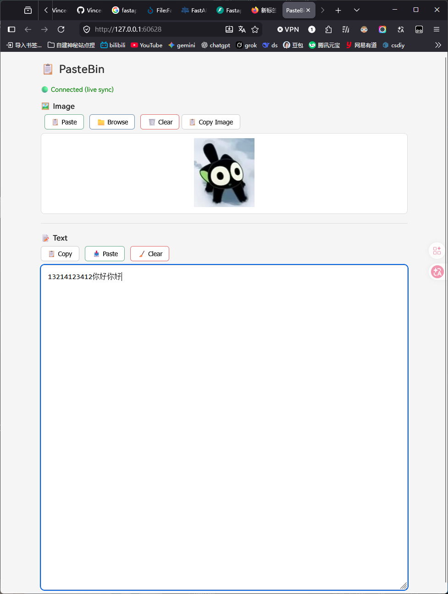
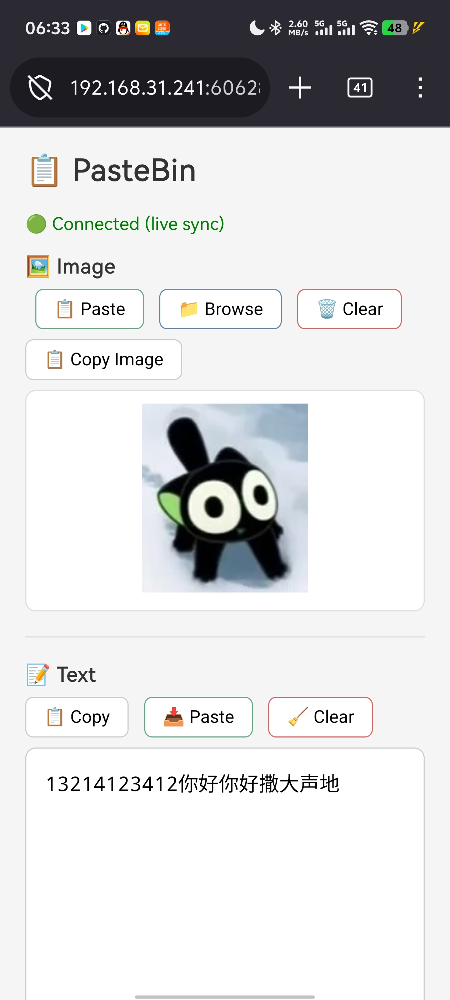

> **[📖 English](readme.md)**
> **[📖 简体中文(大陆)](readme.zh-cn.md)**


[](https://github.com/VincentZyu233/sync-pastebin-page)
[](https://gitee.com/vincent-zyu/sync-pastebin-page)

# 📋 sync-pastebin-page

[](https://python.org/)
[](https://docs.astral.sh/uv/)

[](https://fastapi.tiangolo.com/)
[](https://developer.mozilla.org/en-US/docs/Web/API/WebSocket)

局域网内实时剪贴板同步 — 在一个设备上输入，所有设备立即同步显示。

## 🎯 示例场景

比如局域网内的两台手机和电脑之间临时同步文字或图片。不想装微信 QQ，直接用浏览器打开链接即可。

## 🖼️ 预览

| PC | Phone |
|:-:|:-:|
|  |  |

## 🚀 运行

```bash
uv venv --python 3.13
uv pip install fastapi uvicorn websockets
uv run uvicorn app:app --host 0.0.0.0 --port 60628
```

## 📦 依赖

| Package | Version | Description |
|:--------|:--------|:------------|
| [](https://python.org/) | 3.13 | 运行环境 |
| [](https://fastapi.tiangolo.com/) | latest | Web 框架 |
| [](https://www.uvicorn.org/) | latest | ASGI 服务器 |
| [](https://github.com/encode/uvicorn) | latest | WebSocket 协议支持 |
